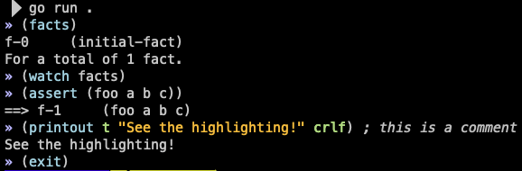

# CLIPSgo Golang Bindings

A Go wrapper for CLIPS, inspired by [clipspy](https://clipspy.readthedocs.io/en/latest/) and implemented using [cgo](https://golang.org/cmd/cgo/).


## Design

CLIPSgo attempts to follow closely the model defined by clipspy. Anyone familiar with clipspy should find clipsgo fairly straightforward to understand. That said there are a few notable areas of differences.

* Because Go is type safe, some APIs work differently out of necessity
* clipsgo adds a `SendCommand` call inspired by [pyclips](http://pyclips.sourceforge.net/web/?q=node/13), enabling an interactive shell.
* clipsgo includes a `Shell()` API call based on this that opens an interactive shell, and includes readline-style history and syntax highlighting
* clipsgo builds into an executable that simply acts as an interactive CLIPS shell

## Interactive use

You may run clipsgo directly in order to use an interactive shell.



Also, in your clipsgo-based programs, you may set up an environment that includes Go-based functions and / or is preloaded with data, then open an interactive session within that environment.

```go
func main() {
	env := clips.CreateEnvironment()
	// ... modify to your liking
	env.Shell()
}
```

## Data Types

CLIPS data types are mapped to GO types as follows

| CLIPS            | Go                 |
| ---------------- | ------------------ |
| INTEGER          | int64              |
| FLOAT            | float64            |
| STRING           | string             |
| SYMBOL           | clips.Symbol       |
| MULTIFIELD       | []interface{}      |
| FACT_ADDRESS     | clips.Fact         |
| INSTANCE_NAME    | clips.InstanceName |
| INSTANCE_ADDRESS | clips.Instance     |
| EXTERNAL_ADDRESS | unsafe.Pointer     |

## Basic Data Abstractions

For detailed information about CLIPS see the [CLIPS documentation](http://www.clipsrules.net/Documentation.html)

While most of the CLIPS documentation starts from _facts_ and _templates_, given that you'll be programming Go I recommend that you build your rules and "facts" based on classes and instances, instead of templates and facts. Everything you can do with facts, you can do with instances, but the reverse is not true. Any Go programmer is likely to be familiar with the object oriented concepts of [CLIPS Object Oriented Language (COOL)](https://www.csie.ntu.edu.tw/~sylee/courses/clips/bpg/node9.html) and in fact may find them more familiar and comfortable than the older, more procedural base language.

### Instances

Instances are instantiations of specific classes. They store values by name, similar to Go maps. They also support inheritance and instance methods using message sending.

```go
import (
    clipsgo "bitbucket.it.keysight.com/qsr/clipsgo.git"
)

env := clipsgo.CreateEnvironment()
defer env.Delete()

err := env.Build(`(defclass Foo (is-a USER)
        (slot bar
            (type INTEGER))
        (multislot baz)
)`)
assert.NilError(t, err)
err := env.Build(`(defmessage-handler Foo handler ()
        (printout t "bar=" ?self:bar crlf)
)`)
assert.NilError(t, err)

inst, err := env.MakeInstance(`(of Foo (bar 12))`)
assert.NilError(t, err)

ret, err := inst.Slot("bar")
assert.NilError(t, err)
assert.Equal(t, ret, int64(12))

ret := inst.Send("handler", "")
```

### Facts

A *fact* is a list of atomic values that are either referenced positionally, for "ordered" or "implied" facts, or by name for "unordered" or "template" facts.

#### Ordered Facts

Ordered Facts represent information as a list of elements. There is no explicit template for an ordered fact, but they do have an implied template. A reference to the implied template of an ordered fact can be obtained, and can be used to programmatically assert ordered facts.

```go
import (
    clipsgo "bitbucket.it.keysight.com/qsr/clipsgo.git"
)

env := clipsgo.CreateEnvironment()
defer env.Delete()

fact, err := env.AssertString(`(foo a b c)`)
defer fact.Drop()

tmpl := fact.Template()
assert.Assert(t, tmpl.Implied())
fact, err = tmpl.NewFact()

ifact, ok := fact.(*ImpliedFact)
assert.Assert(t, ok)

ifact.Append("a")
ifact.Extend([]interface{}{
    Symbol("b"),
    3,
})

ifact.Set(2, "c")
ifact.Assert()
```

#### Template Facts

Unordered facts represent data similar to Go maps. They require a template to be defined, which provides a formal definition for what data is represented by the fact.

```go
import (
    clipsgo "bitbucket.it.keysight.com/qsr/clipsgo.git"
)

env := clipsgo.CreateEnvironment()
defer env.Delete()

env.Build("(deftemplate foo (slot bar) (multislot baz))")

tmpl, err := env.FindTemplate("foo")
assert.NilError(t, err)
fact, err := tmpl.NewFact()
assert.NilError(t, err)

tfact, ok := fact.(*TemplateFact)
assert.Assert(t, ok)

tfact.Set("bar", 4)
tfact.Set("baz", []interface{}{
    Symbol("b"),
    3,
})
ifact.Assert()
```

## Evaluating CLIPS code

It is possible to evaluate CLIPS statements, retrieving their results in Go.

### Eval

```go
import (
    clipsgo "bitbucket.it.keysight.com/qsr/clipsgo.git"
)

env := clipsgo.CreateEnvironment()
defer env.Delete()

ret, err := env.Eval("(create$ foo bar baz)")
```

*Note that this functionality relies on CLIPS `eval` function, which does not accept aribtrary commands. It does not allow CLIPS constructs to be created for example - for that you need `env.Build()`. It also does not allow facts to be asserted - use `env.AssertString()`*

### SendCommand

In order to overcome some of the limitations of the CLIPS `eval` command, clipsgo provides a higher-level function called `SendCommand` which accepts any arbitrary CLIPS command.

```go
import (
    clipsgo "bitbucket.it.keysight.com/qsr/clipsgo.git"
)

env := clipsgo.CreateEnvironment()
defer env.Delete()

// try some stuff that Eval chokes on
err := env.SendCommand("(assert (foo a b c))")
assert.NilError(t, err)
```

This avoids the need to know in advance which call to make. On the other hand, no return value is provided; `SendCommand` is primarily intended for more interactive evaluation of unpredictable input.

## Defining CLIPS Constructs

CLIPS constructs must be defined in CLIPS language. Use the `Load()` or `Build()` functions to define them.

```go
import (
    clipsgo "bitbucket.it.keysight.com/qsr/clipsgo.git"
)

env := clipsgo.CreateEnvironment()
defer env.Delete()

err := env.Build(`(defrule my-rule
    (my-fact first-slot)
=>
    (printout t "My Rule fired!" crlf)
)`)
assert.NilError(t, err)
```

## Embedding Go

The `DefineFunction()` method allows binding a Go function within the CLIPS environment. It will be callable from within CLIPS using the given name as though it had been defined with the `deffunction` construct.

The function defined must have the signature

`func(args []interface{}) (interface{}, error)`

```go
import (
    clipsgo "bitbucket.it.keysight.com/qsr/clipsgo.git"
)

env := clipsgo.CreateEnvironment()
defer env.Delete()

argcount := 0
callback := func(args []interface{}) (interface{}, error) {
    argcount = len(args)
    return nil, nil
}

err := env.DefineFunction("test-callback", callback)
assert.NilError(t, err)

_, err = env.Eval("(test-callback a b c)")
assert.NilError(t, err)
assert.Equal(t, argcount, 3)
```

## Go Reference Objects Lifecycle

All of the Go objects created to interact with the CLIPS environment are simple references to the CLIPS data structure. This means that interactions with the CLIPS shell can cause them to become invalid. In most cases, deleting or undefining an object makes any Go reference to it unusable.

```go
import (
    clipsgo "bitbucket.it.keysight.com/qsr/clipsgo.git"
)

env := clipsgo.CreateEnvironment()
defer env.Delete()

templates := env.Templates()
env.Clear() // From here, all templates are gone so all references are unusable

// this will cause an error
for _, tmpl := range templates {
    fmt.Printf("%v\n", tmpl)
}
```

### Building From Sources

The build requires the CLIPS source code to be available, and to be built into a shared library. The provided Makefile makes this simple.

```bash
$ make
```

There are also targets for `test` and `coverage` to run the test suite.

Once CLIPS is built and available, subsequent builds can be done with a simple `go build`.

## Reference documentation

The code has [Godoc](https://godoc.org/golang.org/x/tools/cmd/godoc) throughout. To view them, run
```bash
$ godoc -http=:6060
```
Then access http://localhost:6060/ from your browser